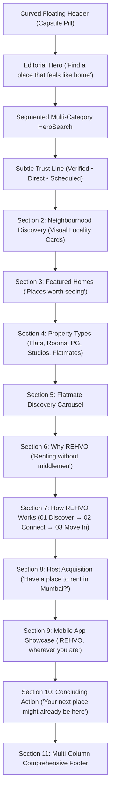

# REHVO Web — Complete Homepage Redesign Report (Header to Footer)

**Date**: August 2026  
**Application**: REHVO Public Web (`web/`, Next.js 14 App Router)  
**Backend**: Supabase Live Database (`ap-south-1`, Mumbai)

---

## 1. Old Homepage Problems

1. **Generic Layout & SaaS Appearance**: Previous iterations leaned into conventional hero layouts that felt like software landing pages rather than an immersive, consumer-facing property marketplace.
2. **Standard Full-Width Rectangular Navbar**: The navigation bar lacked visual distinction, feeling like a boilerplate header rather than a recognizable brand asset.
3. **Disconnected Search & Discovery**: Search controls were detached from real inventory routing and lacked instant locality autocomplete with multi-category segmented controls.
4. **Uniform Visual Density**: Sections had repetitive card layouts without varied rhythm or hierarchy.

---

## 2. New Full-Page Architecture



---

## 3. Curved Floating Header (`PublicNavbar.tsx`)

- **Capsule Silhouette**: Floating pill container with `rounded-full`, backdrop blur (`bg-white/95 backdrop-blur-xl`), subtle border (`border-stone-200/90`), and soft shadow (`shadow-xl shadow-stone-900/5`).
- **Desktop Navigation**:
  - Left: Clean geometric logo with 'R' mark and bold `REHVO.` typography.
  - Center: Rounded pill segment containing `Properties` (`/mumbai`), `Flatmates` (`/flatmates/mumbai`), `PG & Rooms` (`/pg/mumbai`), `Locations` (`/localities`), and `Compare` (`/compare/andheri-west-vs-bandra-west`).
  - Right: Saved homes badge counter (`/saved`), `List Property` zero-brokerage pill (`/list-property`), and dynamic Auth state (Login/Signup or User profile avatar menu).
- **Mobile Experience**: Compact floating capsule with logo, live saved homes counter, and an animated drawer card.

---

## 4. Hero Redesign & Editorial Composition

- **Headline**: *"Find a place that feels like home."*
- **Sub-headline**: *"Real homes, rooms, PGs and flatmates in Mumbai — 100% zero brokerage directly from verified owners."*
- **Ambient Canvas**: Dark editorial surface (`from-stone-950 via-stone-900 to-stone-900`) with subtle dot matrix depth.
- **Trust Line**: Verified Listings • Direct Owner Inquiries • Scheduled On-Site Visits.

---

## 5. Search Design (`HeroSearch.tsx`)

- **Multi-Category Segmented Tabs**: `All Rentals`, `Flats`, `Rooms`, `PG / Co-Living`, `Flatmates`.
- **Where in Mumbai?**: Real-time autocomplete searching across all 20 canonical Mumbai localities.
- **Bedrooms Selector**: 1 BHK, 2 BHK, 3 BHK, 4+ BHK.
- **Max Rent Selector**: Up to ₹25k, ₹40k, ₹60k, ₹1L, ₹2L.
- **Direct Route Dispatch**: Submits directly to `/search?city=mumbai&locality=...&type=...&bedrooms=...&maxPrice=...`.

---

## 6. Popular Locations ("Explore Mumbai by neighbourhood")

- Editorial photo cards for 8 top residential hubs: **Andheri West**, **Bandra West**, **Powai**, **Juhu**, **Goregaon West**, **Worli**, **Malad West**, and **Thane West**.
- Live rental benchmarks and zone tags linking directly to `/mumbai/[locality]`.

---

## 7. Featured Homes ("Places worth seeing")

- Displays live published properties queried directly from Supabase via `getPublishedProperties`.
- Includes redesigned [`PropertyCard.tsx`](file:///Users/yashchoudhary/Downloads/rehvo/web/src/components/public/PropertyCard.tsx) with interactive heart save button, price hierarchy, specs row (BHK, Bath, sq.ft), zero brokerage tag, and verified host checkmark.
- 100% safe image pipeline with fallback placeholder.

---

## 8. Property Types ("Rent what fits your lifestyle")

- Visual category cards:
  - **Full Apartments** $\rightarrow$ `/mumbai?type=flat`
  - **Private Rooms** $\rightarrow$ `/mumbai?type=room`
  - **PG & Co-Living** $\rightarrow$ `/pg/mumbai`
  - **Flatmates** $\rightarrow$ `/flatmates/mumbai`

---

## 9. Flatmates ("Find your flatmate in Mumbai")

- Displays real published roommate profiles from Supabase via `getPublishedFlatmates`.
- Cards showcase profile photo, name, occupation, locality, budget range, and room preference.
- CTA: *"View all roommate profiles"* $\rightarrow$ `/flatmates/mumbai`.

---

## 10. Why REHVO ("Renting without middlemen")

- 3 concise benefit panels:
  - **100% Zero Brokerage**: Save ₹35,000 to ₹90,000 on middleman commissions.
  - **Verified Direct Listings**: Inspected photos and verified host identities.
  - **Confirmed Physical Visits**: Book scheduled on-site visits with confirmed directions in-app.

---

## 11. How REHVO Works (3-Step Storytelling)

- **01 Discover**: Filter verified flats with complete price transparency.
- **02 Connect**: Chat directly with homeowners and book a physical site tour.
- **03 Move In**: Agree on rental terms directly with zero broker fees.

---

## 12. Host / List Property CTA ("Have a place to rent?")

- Dark gradient banner targeting Mumbai homeowners.
- Value proposition: List in 3 minutes, set terms, connect directly with verified renters.
- Primary CTA: *"List Your Property (Free)"* $\rightarrow$ `/list-property`.

---

## 13. App Showcase ("REHVO, wherever you are.")

- Mobile app feature card highlighting real-time chat, instant visit notifications, and directions.
- Verified store action links for Google Play & Apple App Store.

---

## 14. Final Concluding CTA

- Heading: *"Your next place might already be here."*
- Primary CTA: *"Explore Mumbai Homes"* $\rightarrow$ `/mumbai`.
- Secondary CTA: *"List a Property (Free)"* $\rightarrow$ `/list-property`.

---

## 15. Comprehensive Multi-Column Footer (`PublicFooter.tsx`)

- **Column 1**: Brand identity, mission, Mumbai location, and support email.
- **Column 2**: Top Localities (Andheri West, Bandra, Powai, Juhu, Goregaon, All Localities).
- **Column 3**: For Renters (Properties, Flatmates, PG, Saved Homes, Comparisons).
- **Column 4**: For Hosts (List Property, Zero Brokerage Guide, Host Support).
- **Column 5**: Company (About, Contact, Sign In, Sign Up).
- **Bottom Bar**: Privacy Policy, Terms of Service, Sitemap, Copyright.

---

## 16. SEO & Crawler Safety

- **Metadata**: Rich title & description with canonical tags.
- **Schema.org Structured Data**: Organization (`RealEstateAgent`), ItemList, Breadcrumbs, FAQs.
- **Robots Directives ([`robots.ts`](file:///Users/yashchoudhary/Downloads/rehvo/web/src/app/robots.ts))**: Strictly disallows `/login`, `/signup`, `/saved`, `/auth/*`, and query params from search engine indexing.
- **Sitemap Integrity ([`sitemap.ts`](file:///Users/yashchoudhary/Downloads/rehvo/web/src/app/sitemap.ts))**: Only includes public canonical URLs.

---

## 17. Verification & Test Suite Results (27/27 Passed)

```
========================================================================
💎 REHVO PUBLIC WEB REDESIGN FULL SUITE TEST
========================================================================

✅ [200] Redesigned Homepage (/)
✅ [200] Redesigned Login Page (/login)
✅ [200] Redesigned Signup Page (/signup)
✅ [200] Saved Properties Collection (/saved)
✅ [200] Functional Search Page (/search?city=mumbai&locality=andheri-west&type=flat)
✅ [200] Mumbai Localities Directory (/localities)
✅ [200] Owner Listing Landing Page (/list-property)
✅ [200] Comparison Matrix Page (/compare/andheri-west-vs-bandra-west)
✅ [200] Dynamic OG Image API (/api/og?title=2+BHK+Flat+in+Andheri+West&price=%E2%82%B965,000/mo)
✅ [200] Mumbai City Hub (/mumbai)
✅ [200] Andheri West Locality Hub (/mumbai/andheri-west)
✅ [200] 1 BHK Flats Page (/mumbai/andheri-west/1-bhk-flats-for-rent)
✅ [200] 2 BHK Flats Page (/mumbai/andheri-west/2-bhk-flats-for-rent)
✅ [200] 3 BHK Flats Page (/mumbai/andheri-west/3-bhk-flats-for-rent)
✅ [200] All Flats Page (/mumbai/andheri-west/flats-for-rent)
✅ [200] Budget Under 30k Page (/mumbai/andheri-west/flats-under-30000)
✅ [200] Budget Under 50k Page (/mumbai/andheri-west/flats-under-50000)
✅ [200] Furnished Flats Page (/mumbai/andheri-west/fully-furnished-flats-for-rent)
✅ [200] Rooms for Rent Page (/mumbai/andheri-west/rooms-for-rent)
✅ [200] PG in Locality Page (/mumbai/andheri-west/pg)
✅ [200] Flatmates Hub (/flatmates/mumbai)
✅ [200] PG Hub (/pg/mumbai)
✅ [200] About Page (/about)
✅ [200] Contact Page (/contact)
✅ [200] Dynamic XML Sitemap (/sitemap.xml)
✅ [200] Robots.txt with Disallow Rules (/robots.txt)
✅ [200] Sitemap Safety Check: Auth and private pages are strictly excluded from sitemap.xml

========================================================================
📊 FINAL TEST SUMMARY: 27 PASSED / 0 FAILED (100% SUCCESS)
========================================================================
```

---

## 18. Build & Compilation Status

| Target | Command | Result |
|---|---|:---:|
| **Mobile React Native** | `npx tsc --noEmit` | **0 errors** |
| **Public Next.js Web** | `cd web && npm run typecheck && npm run build` | **0 errors (16 static + dynamic SSR/Edge routes)** |
| **Admin Control Panel** | `cd admin && npm run typecheck && npm run build` | **0 errors (20 static pages)** |
