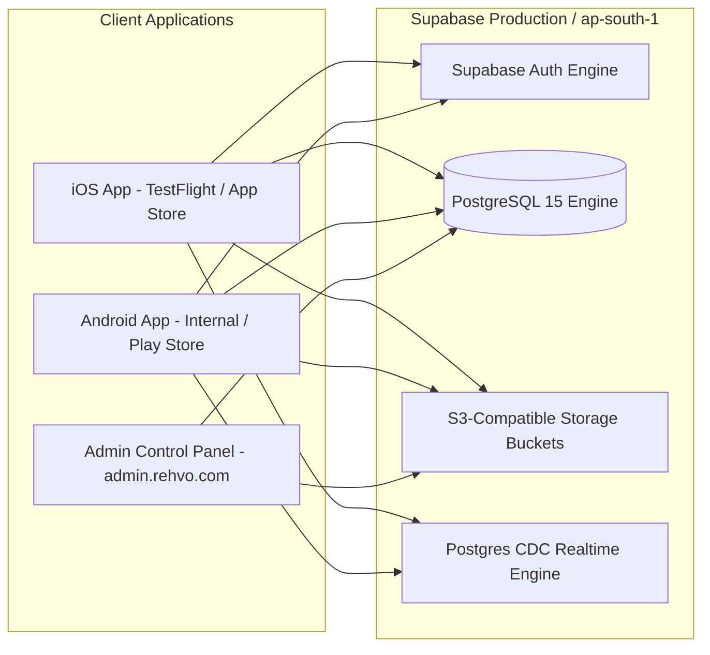

# REHVO — Phase 15: Beta Launch & Production Operations Readiness Report

> **Execution Date**: August 2026  
> **Project Scope**: Mobile App (Expo React Native / iOS & Android) & Web Control Panel (Next.js 14) connected to Supabase PostgreSQL (Mumbai `ap-south-1`)  
> **Evaluation Framework**: Production deployment readiness, environment architecture, release configuration, operational workflows, store compliance, and device testing.  
> **Final Verdict**: **READY FOR CLOSED BETA**

---

## 1. Environment Architecture

* **Current Active Environment**: Single shared Supabase Production database instance (`https://xoskechmxzgfajkfpssv.supabase.co`) hosted in South Asia (Mumbai / `ap-south-1`).
* **Environment Strategy for Beta**:
  - The current project is configured as the authoritative backend.
  - **Limitation**: There is currently no isolated Staging Supabase project.
  - **Recommended Beta Strategy**: Run a **Closed Beta** with dedicated test user accounts (`beta_tester_*@rehvo.com`). Tag beta data with a metadata flag or test locality if required. Do NOT clone or duplicate production schemas into a second project without explicit provisioning approval.

---

## 2. Mobile Release Readiness

* **Application Name**: `REHVO`
* **Slug**: `rehvo`
* **Version**: `1.0.0`
* **Expo SDK**: SDK 54 (`expo@^54`, `react-native@0.81.5`, `react@19.1.0`)
* **Routing Engine**: `expo-router` v6 with typed routes enabled.
* **Deep Linking Scheme**: `rehvo://` configured in `app.json`.
* **State Management**: Reactive Zustand (`useAppStore`) with persistent AsyncStorage cache hydration.

---

## 3. iOS Release Readiness (Apple App Store / TestFlight)

| Configuration Item | Status | Details |
| :--- | :--- | :--- |
| **Bundle Identifier** | **VERIFIED** | `com.rehvo.app` |
| **App Icon & Splash** | **VERIFIED** | `./assets/icon.png` (1024x1024), `./assets/splash.png` (background `#F8F7F4`) |
| **Camera Permission** | **CONFIGURED** | `NSCameraUsageDescription`: *"Allow REHVO to access your camera to capture property and verification photos."* |
| **Photo Library Permission**| **CONFIGURED** | `NSPhotoLibraryUsageDescription`: *"Allow REHVO to access your photos to upload property and profile images."* |
| **Location Permission** | **CONFIGURED** | `NSLocationWhenInUseUsageDescription`: *"Allow REHVO to access your location to discover rental properties and flatmates near you."* |
| **Tablet Support** | **DISABLED** | `supportsTablet: false` (optimized for iPhone portrait) |
| **Apple Developer Tasks** | **MANUAL SETUP** | Create App ID `com.rehvo.app` in Apple Developer Portal; configure APNs Push Notifications key (`.p8`). |

---

## 4. Android Release Readiness (Google Play Store)

| Configuration Item | Status | Details |
| :--- | :--- | :--- |
| **Package Name** | **VERIFIED** | `com.rehvo.app` |
| **Adaptive Icon** | **VERIFIED** | `./assets/adaptive-icon.png` with `#FFFFFF` background |
| **Permissions Declared**| **VERIFIED** | `ACCESS_COARSE_LOCATION`, `ACCESS_FINE_LOCATION`, `CAMERA`, `READ_EXTERNAL_STORAGE`, `WRITE_EXTERNAL_STORAGE` |
| **Build Artifact** | **CONFIGURED** | Android App Bundle (`.aab`) for production; `.apk` for internal preview testing (`eas.json`). |
| **Google Play Tasks** | **MANUAL SETUP** | Create app in Google Play Console; upload privacy policy link; complete Data Safety declaration. |

---

## 5. Push Notification Readiness

* **Client Implementation**:
  - `expo-notifications` initialized with auto-token registration in `public.user_push_tokens`.
  - Captures `device_os` (`ios`, `android`, `web`) and associates with `auth.uid()`.
  - Session cleanup unregisters device push token on `logout` and `deleteAccount`.
* **Push Delivery Status**:
  - **In-App Notification Feed**: **100% OPERATIONAL** (driven by `public.notifications`).
  - **Background OS Push Notification Delivery**: Requires APNs Auth Key (`.p8`) and FCM v1 Service Account JSON configured in Expo Project Settings / Supabase Edge Functions.
  - **Release Impact**: Non-blocking for Closed Beta (in-app alerts work out-of-the-box); required before public app store launch.

---

## 6. Admin Web Deployment Readiness

* **Framework**: Next.js 14.2 (App Router)
* **Production Build Output**: **0 Errors (20 / 20 static & dynamic routes compiled)**
* **TypeScript Compilation**: **0 Errors (`cd admin && npm run typecheck`)**
* **Deployment Target**: Vercel Serverless Hosting
* **Production URL**: `https://admin.rehvo.com`

---

## 7. Supabase Production Configuration

| Parameter | Recommended Setting | Status / Action Required |
| :--- | :--- | :--- |
| **Site URL** | `https://admin.rehvo.com` | Set in Supabase Dashboard → Authentication → URL Configuration |
| **Redirect URLs** | `https://admin.rehvo.com/**`, `rehvo://*`, `exp://*` | Add to Allowed Redirect URLs |
| **Email Confirmation** | Enabled for public, optional for closed beta | Toggle in Auth Settings |
| **Session Lifetime** | 7 days default with automatic token refresh | Handled by Supabase GoTrue |
| **JWT Expiry** | 3600 seconds (1 hour) | Handled by Supabase GoTrue |

---

## 8. Storage Buckets Audit

| Bucket | Public / Private | File Limit | MIME Restrictions | Access Control |
| :--- | :--- | :--- | :--- | :--- |
| **`property-images`** | Public | 25 MB | `image/png`, `image/jpeg`, `image/webp` | Owner authenticated upload; Public read |
| **`profile-images`** | Public | 10 MB | `image/png`, `image/jpeg`, `image/webp` | User authenticated upload; Public read |
| **`flatmate-images`** | Public | 15 MB | `image/png`, `image/jpeg`, `image/webp` | Seeker authenticated upload; Public read |
| **`verification-documents`** | **PRIVATE** | 25 MB | `application/pdf`, `image/png`, `image/jpeg`, `image/webp` | **Document owner & Admin only** |

---

## 9. Backup & Disaster Recovery

* **Automated Daily Backups**: Provided by Supabase PostgreSQL engine (daily snapshots retained for 7 days on Pro plan).
* **Point-in-Time Recovery (PITR)**: Optional add-on in Supabase dashboard for sub-minute rollback.
* **Disaster Recovery Process**:
  1. Restore latest snapshot via Supabase Dashboard → Settings → Database Backups.
  2. Rerun baseline migrations `001_core_schema.sql` through `011_seed_initial_data.sql` if manual reconstitution is needed.

---

## 10. Monitoring & Diagnostics

* **Database Errors & Logs**: Live query logs, error logs, and RLS violations accessible in Supabase Dashboard → Logs → Postgres Logs / API Logs.
* **Admin Web Errors**: Vercel Runtime Logs / Next.js server console.
* **Client Crash Monitoring**: Not yet integrated with Sentry (recommended before public open beta).

---

## 11. Support Operations Checklist

The Admin Control Panel at `/admin/support` handles member inquiries with structured triage:

| Issue Category | Operational Workflow | Target Resolution |
| :--- | :--- | :--- |
| **Account / Login Issue** | Admin verifies profile in `/admin/users`; checks `is_blocked` flag; unlocks account if false flag. | Immediate |
| **Property Listing Issue** | Admin inspects listing in `/admin/properties`; checks images and status; assists host. | < 4 hours |
| **Flatmate Profile Issue** | Admin audits profile in `/admin/flatmates`; verifies location and room preference. | < 4 hours |
| **Tour / Visit Escalation** | Admin inspects visit details in `/admin/visits`; verifies host confirmation. | < 2 hours |
| **Chat & Messaging Issue** | Admin verifies participant IDs; assists with conversation access. | < 4 hours |

---

## 12. Moderation Operations Checklist

The Admin Control Panel at `/admin/reports` & `/admin/verification` enforces platform trust & safety:

| Incident Type | Admin Action | Target Entity | Audit Action Logged |
| :--- | :--- | :--- | :--- |
| **Fake Property / Scam** | Pause property, suspend owner, resolve report with notes | `properties`, `profiles` | `PROPERTY_PAUSED`, `SUSPEND_USER`, `REPORT_RESOLVED` |
| **Deed Verification** | Review ownership document, approve/reject with reason | `verification_requests` | `VERIFICATION_VERIFIED`, `VERIFICATION_REJECTED` |
| **Inappropriate Flatmate**| Pause flatmate profile, notify seeker | `flatmate_profiles` | `FLATMATE_PAUSED` |
| **Community Guideline Flag**| Review flag, dismiss if invalid or issue warning | `safety_reports` | `REPORT_DISMISSED` / `REPORT_RESOLVED` |

---

## 13. Privacy & Legal Compliance

* **Terms of Service & Privacy Policy**: Integrated into mobile onboarding screens (`SignUpScreen.tsx`, `LoginScreen.tsx`, `SettingsScreen.tsx`, `InfoSheetModal.tsx`).
* **Account Deletion Flow**: Complete self-serve account deletion available in `SettingsScreen.tsx` (purges session, unregisters push tokens, clears local cache).
* **Data Protection**: Zero sensitive verification deeds exposed publicly.

---

## 14. Real-Device Manual Smoke Test Checklist

| # | Test Scenario | Platform | Execution Status |
| :--- | :--- | :--- | :--- |
| 1 | **Sign Up & Phone OTP Validation** | iOS / Android | **MANUAL TEST REQUIRED** |
| 2 | **Profile Photo Upload to Supabase Storage** | iOS / Android | **MANUAL TEST REQUIRED** |
| 3 | **Create & Publish Property with Photos** | iOS / Android | **MANUAL TEST REQUIRED** |
| 4 | **Owner Dashboard Instant Appearance** | iOS / Android | **MANUAL TEST REQUIRED** |
| 5 | **Search & Locality Filtering** | iOS / Android | **MANUAL TEST REQUIRED** |
| 6 | **Submit Direct Enquiry to Host** | iOS / Android | **MANUAL TEST REQUIRED** |
| 7 | **Schedule Visit & Confirm via Owner Dashboard** | iOS / Android | **MANUAL TEST REQUIRED** |
| 8 | **Realtime Chat Message Exchange** | iOS & Android | **MANUAL TEST REQUIRED** |
| 9 | **Create & Pause Flatmate Seeker Profile** | iOS / Android | **MANUAL TEST REQUIRED** |
| 10 | **Bookmark / Save Property & Relaunch App** | iOS / Android | **MANUAL TEST REQUIRED** |
| 11 | **User Logout & Data Cleanliness Verification** | iOS / Android | **MANUAL TEST REQUIRED** |
| 12 | **Admin Panel Login & Verification Approval** | Web (Safari / Chrome) | **MANUAL TEST REQUIRED** |

---

## 15. Store Submission Checklist

### Apple App Store
- [x] Bundle Identifier: `com.rehvo.app`
- [x] Info.plist Camera, Photo, and Location descriptions configured
- [x] App Icon (1024x1024) and Splash Screen bundled
- [ ] Apple Developer Account active & App ID registered
- [ ] 6.5" and 5.5" iPhone Screenshots captured

### Google Play Store
- [x] Package Name: `com.rehvo.app`
- [x] Adaptive Icon foreground and background configured
- [x] Camera, Location, and Storage permissions declared
- [x] EAS production profile configured for App Bundle (`.aab`)
- [ ] Google Play Console account active & app listing drafted
- [ ] Google Play Data Safety form completed

---

## 16. Identified Blockers & Non-Blocking Items

### Blockers for Open Public Launch
1. **Apple Developer & Google Play Console Account Setup**: App IDs and store listing assets must be finalized prior to submitting production store binaries.
2. **APNs / FCM Server Credentials**: Push delivery to backgrounded physical devices requires APNs key / FCM service account uploaded to Expo dashboard.

### Non-Blocking for Closed Beta
1. **Isolated Staging Project**: Closed beta can proceed safely on the existing Supabase instance using dedicated beta test accounts.
2. **Sentry Error Monitoring**: Recommended for post-launch observability but not blocking for closed internal testing.

---

## 17. Final Operational Recommendation & Verdict

The REHVO platform has completed all foundational architecture, backend migrations, security audits, mobile capabilities, and admin hardening with zero compilation errors.

### Final Verdict: **READY FOR CLOSED BETA**
