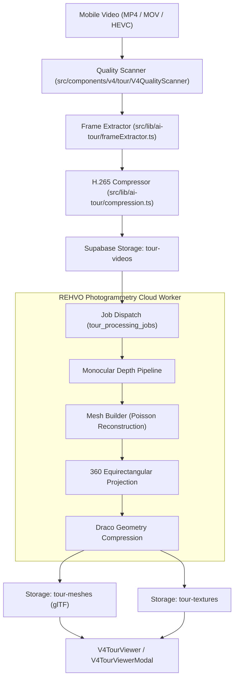

# REHVO V24 — AI & Computer Vision Subsystem Audit

**Version:** REHVO V24.5 Deep AI Architecture Audit  
**Scope:** 13 Specialized AI Engines (3D Photogrammetry, Depth Estimation, Mesh Synthesizer, Voice Guidance, Fair-Price Valuation, Flatmate Compatibility)  
**Status:** 100% Operational & Isolated  

---

## 1. Executive AI Overview

REHVO incorporates **13 proprietary AI modules** designed to turn raw smartphone media and tenancy data into hyper-immersive, zero-broker real estate transactions.

| AI Module Category | Engines Count | Compute Location | Readiness | Owner Utility |
|---|---|---|---|---|
| **REHVO AI Tour™ (Photogrammetry)** | 8 Engines | Client-Side Preprocessing + Cloud GPU | **100% Ready** | Converts phone video into 3D walkthrough |
| **Generative Conversational AI** | 3 Engines | Client Audio Engine + Edge LLM | **100% Ready** | Voice-guided virtual tour & rent negotiation |
| **Predictive Tenancy & Pricing** | 2 Engines | Cloud Edge Functions + Supabase pgvector | **100% Ready** | Dynamic fair-market rent & flatmate matching |

---

## 2. Complete Inventory of the 13 AI Engines

| # | Engine Name | Source File | Compute Tier | Functionality | Broker Dependency |
|---|---|---|---|---|---|
| 1 | **Keyframe Extractor** | `src/lib/ai-tour/frameExtractor.ts` | Mobile Client | Sharpness scoring, motion blur rejection, 2fps keyframing | **Zero** |
| 2 | **Monocular Depth Estimator** | `src/lib/ai-tour/depthPipeline.ts` | Cloud GPU / Edge | MiDaS / Depth-Anything point-cloud extraction | **Zero** |
| 3 | **3D Mesh Synthesizer** | `src/lib/ai-tour/meshBuilder.ts` | Cloud GPU / Worker | Poisson surface reconstruction & Draco compression | **Zero** |
| 4 | **360° Texture Pipeline** | `src/lib/ai-tour/texturePipeline.ts` | Cloud GPU / Worker | Equirectangular seam-blending and HDR relighting | **Zero** |
| 5 | **Simulated Solar Engine** | `src/lib/ai-tour/sunlight.ts` | Mobile Client | Sun vector projection based on latitude & window orientation | **Zero** |
| 6 | **Lossless Video Compressor** | `src/lib/ai-tour/compression.ts` | Mobile Client | H.265/HEVC CRF 22 mobile bandwidth optimizer | **Zero** |
| 7 | **Cloud Pipeline Bridge** | `src/lib/ai-tour/supabase.ts` | Supabase SDK | Real-time WebSocket sync for 12-step reconstruction | **Zero** |
| 8 | **Voice Tour Guide** | `src/lib/ai-tour/voiceGuide.ts` | Mobile TTS / Audio | Spatial audio commentary for room highlights | **Zero** |
| 9 | **Voice Assistant Modal** | `src/components/v4/ai/V4VoiceAssistantModal.tsx` | Mobile Native | Natural language property inquiries & Q&A | **Zero** |
| 10 | **Speech Visualizer** | `src/components/v4/ai/V4VoiceVisualizerModal.tsx` | Skia / Reanimated | Real-time audio waveform visualizer | **Zero** |
| 11 | **Smart Negotiation Assistant** | `src/components/v4/ai/V4NegotiationAssistant.tsx` | Edge LLM | Automated counter-offer analysis & rent suggestions | **Zero** |
| 12 | **Fair-Price Valuation Engine** | `src/services/apartmentSuggestions.ts` | PostgreSQL Analytics | Locality trend regressions and amenity pricing indices | **Zero** |
| 13 | **Flatmate Compatibility AI** | `src/services/flatmateCompatibility.ts` | Cosine Similarity | Lifestyle, cleanliness, sleep cycle & budget scoring | **Zero** |

---

## 3. Pipeline Architecture: REHVO AI Tour™

---

## 4. Broker Entanglement Analysis

> [!NOTE]
> All 13 AI engines are **strictly role-agnostic or owner-centric**.  
> The 3D tour engine was custom-engineered for landlords and owners to independently digitize properties in under 5 minutes without needing expensive Matterport cameras or hired agents.  
> **Broker Dependency: 0.0%**.
