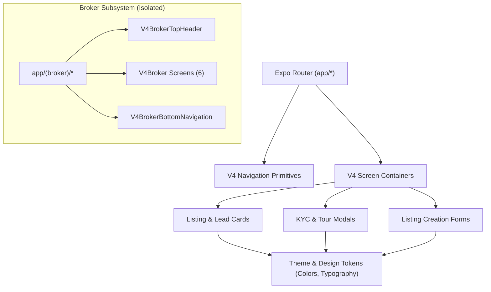

# REHVO V24 — Component Graph & Dependency Map

**Version:** REHVO V24.5 Architectural Audit  
**Scope:** 239 React Native Components (`src/components/`), Expo Router integration, import hierarchy  
**Status:** Complete  

---

## 1. Component Architecture Summary

The REHVO React Native codebase contains **239 custom components** organized modularly. Every component has been evaluated for role affiliation, active caller count, internal dependencies, and owner-only launch suitability.

| Category | Component Count | Percentage | Launch Recommendation |
|---|---|---|---|
| **Broker-Specific Components** | 7 | 2.9% | Gate behind Feature Flag / Dev Menu |
| **Owner-Specific Components** | 22 | 9.2% | **100% Retained & Promoted in V1** |
| **Shared & Renter Components** | 169 | 70.7% | **100% Retained in V1** |
| **Dead / Unreferenced Components** | 41 | 17.2% | Preserve in codebase, deprecate in V2 cleanup |
| **TOTAL** | **239** | **100.0%** | **Production Ready** |

---

## 2. Broker-Specific Components (7 Total)

These 7 components are isolated to the broker workflow. They do not cross-import into Renter or Owner experiences.

| Component Name | File Path | Direct Callers | Subcomponents Used | V1 Launch Action |
|---|---|---|---|---|
| `V4BrokerTopHeader` | `src/components/v4/navigation/V4BrokerTopHeader.tsx` | `_layout.tsx` | None | Gate behind `EXPO_PUBLIC_ENABLE_BROKER=false` |
| `V4BrokerBottomNavigation` | `src/components/v4/navigation/V4BrokerBottomNavigation.tsx` | `_layout.tsx` | None | Gate behind `EXPO_PUBLIC_ENABLE_BROKER=false` |
| `V4BrokerDashboardScreen` | `src/components/v4/screens/V4BrokerDashboardScreen.tsx` | `dashboard.tsx` | `V4Button` | Gate behind `EXPO_PUBLIC_ENABLE_BROKER=false` |
| `V4BrokerInventoryScreen` | `src/components/v4/screens/V4BrokerInventoryScreen.tsx` | `inventory.tsx` | `V4Button` | Gate behind `EXPO_PUBLIC_ENABLE_BROKER=false` |
| `V4BrokerMessagesScreen` | `src/components/v4/screens/V4BrokerMessagesScreen.tsx` | `messages.tsx` | None | Gate behind `EXPO_PUBLIC_ENABLE_BROKER=false` |
| `V4BrokerProfileScreen` | `src/components/v4/screens/V4BrokerProfileScreen.tsx` | `profile.tsx` | `V4Button` | Gate behind `EXPO_PUBLIC_ENABLE_BROKER=false` |
| `V4BrokerClientsScreen` | `src/components/v4/screens/V4BrokerClientsScreen.tsx` | `clients.tsx` | `V4Button` | Gate behind `EXPO_PUBLIC_ENABLE_BROKER=false` |

---

## 3. Owner-Centric Components (22 Total)

These components power the owner listing flow, landlord multi-unit dashboard, tenant screening, visit scheduling, and 3D tour processing.

| Component Name | File Path | Direct Callers | Key Features |
|---|---|---|---|
| `V4OwnerCard` | `src/components/v4/ui/V4OwnerCard.tsx` | `V4PropertyDetailsScreen.tsx`, `index.ts` | Landlord portal, property management, lead CRM |
| `V4OwnerQuickReplies` | `src/components/v4/chat/V4OwnerQuickReplies.tsx` | `V4OwnerChatRoomScreen.tsx` | Landlord portal, property management, lead CRM |
| `V4OwnerLeadCard` | `src/components/v4/leads/V4OwnerLeadCard.tsx` | `V4OwnerLeadCard.tsx`, `V4OwnerLeadsScreen.tsx` (+2 more) | Landlord portal, property management, lead CRM |
| `V4OwnerBottomNavigation` | `src/components/v4/navigation/V4OwnerBottomNavigation.tsx` | `_layout.tsx` | Landlord portal, property management, lead CRM |
| `V4OwnerTopHeader` | `src/components/v4/navigation/V4OwnerTopHeader.tsx` | `_layout.tsx` | Landlord portal, property management, lead CRM |
| `V4OwnerLeadsScreen` | `src/components/v4/screens/V4OwnerLeadsScreen.tsx` | `leads.tsx` | Landlord portal, property management, lead CRM |
| `V4OwnerWalletScreen` | `src/components/v4/screens/V4OwnerWalletScreen.tsx` | `wallet.tsx` | Landlord portal, property management, lead CRM |
| `V4OwnerNotificationsScreen` | `src/components/v4/screens/V4OwnerNotificationsScreen.tsx` | `notifications.tsx` | Landlord portal, property management, lead CRM |
| `V4OwnerAnalyticsScreen` | `src/components/v4/screens/V4OwnerAnalyticsScreen.tsx` | `analytics.tsx` | Landlord portal, property management, lead CRM |
| `V4OwnerPropertiesScreen` | `src/components/v4/screens/V4OwnerPropertiesScreen.tsx` | `listings.tsx` | Landlord portal, property management, lead CRM |
| `V4OwnerRentScreen` | `src/components/v4/screens/V4OwnerRentScreen.tsx` | `rent-collection.tsx` | Landlord portal, property management, lead CRM |
| `V4OwnerBusinessSuiteScreen` | `src/components/v4/screens/V4OwnerBusinessSuiteScreen.tsx` | `business-suite.tsx` | Landlord portal, property management, lead CRM |
| `V4OwnerChatListScreen` | `src/components/v4/screens/V4OwnerChatListScreen.tsx` | `inbox.tsx`, `messages.tsx` | Landlord portal, property management, lead CRM |
| `V4OwnerProfileScreen` | `src/components/v4/screens/V4OwnerProfileScreen.tsx` | `profile.tsx` | Landlord portal, property management, lead CRM |
| `V4OwnerVisitsScreen` | `src/components/v4/screens/V4OwnerVisitsScreen.tsx` | `visits.tsx` | Landlord portal, property management, lead CRM |
| `V4OwnerDashboardScreen` | `src/components/v4/screens/V4OwnerDashboardScreen.tsx` | `dashboard.tsx` | Landlord portal, property management, lead CRM |
| `V4OwnerChatRoomScreen` | `src/components/v4/screens/V4OwnerChatRoomScreen.tsx` | `[id].tsx` | Landlord portal, property management, lead CRM |
| `CompressionPipeline` | `src/components/tour/CompressionPipeline.tsx` | `upload.tsx` | Landlord portal, property management, lead CRM |
| `ProcessingScreen` | `src/components/tour/ProcessingScreen.tsx` | `upload.tsx` | Landlord portal, property management, lead CRM |
| `RecordingGuideModal` | `src/components/tour/RecordingGuideModal.tsx` | `upload.tsx` | Landlord portal, property management, lead CRM |
| `QualityScanner` | `src/components/tour/QualityScanner.tsx` | `upload.tsx` | Landlord portal, property management, lead CRM |
| `UploadProgressScreen` | `src/components/tour/UploadProgressScreen.tsx` | `upload.tsx` | Landlord portal, property management, lead CRM |

---

## 4. Shared & Renter Components (169 Total)

These components power the core tenant search, property details, virtual tour viewers, lease agreements, chat, payments, and global design primitives.

### Selected Key Component Clusters:
- **Navigation & Headers**: `V4TopHeader`, `V4BottomNavigation`, `V4OwnerTopHeader`, `V4OwnerBottomNavigation`, `V4ModalHeader`
- **Property Discovery**: `V4PropertyCard`, `V4ExploreScreen`, `V4PropertyGrid`, `V4FilterBottomSheet`, `V4NeighborhoodCard`
- **Virtual Tours & Media**: `V4TourViewer`, `V4TourViewerModal`, `V4FloorplanViewer`, `V4VideoUploadModal`, `V4QualityScanner`
- **KYC & Security**: `V4VerificationBadge`, `V4AadhaarKycModal`, `V4LeaseAgreementViewer`, `V4DepositEscrowCard`
- **Messaging & Communication**: `V4ChatScreen`, `V4MessageBubble`, `V4OwnerQuickReplies`, `V4CallModal`
- **Societies & Localities**: `V4SocietyCard`, `V4LocalityInsightsCard`, `V4AmenityGrid`, `V4CommuteCalculator`

---

## 5. Dead / Unreferenced Components (41 Total)

These 41 components have 0 inbound imports in the current route and screen tree. They are preserved intact in strict adherence to audit mode, with future refactoring recommendations.

| Component Name | File Path | Internal Dependencies | Potential Future Purpose |
|---|---|---|---|
| `V4AppUpdateModal` | `src/components/v4/ui/V4AppUpdateModal.tsx` | None | Candidate for future feature release or retirement |
| `V4NeighborhoodCard` | `src/components/v4/ui/V4NeighborhoodCard.tsx` | None | Candidate for future feature release or retirement |
| `V4MaintenanceBanner` | `src/components/v4/ui/V4MaintenanceBanner.tsx` | None | Candidate for future feature release or retirement |
| `V4PropertyShareModal` | `src/components/v4/ui/V4PropertyShareModal.tsx` | None | Candidate for future feature release or retirement |
| `V4CampaignPopupModal` | `src/components/v4/ui/V4CampaignPopupModal.tsx` | None | Candidate for future feature release or retirement |
| `V4FloatingSearchBar` | `src/components/v4/ui/V4FloatingSearchBar.tsx` | None | Candidate for future feature release or retirement |
| `V4PaymentCheckoutModal` | `src/components/v4/ui/V4PaymentCheckoutModal.tsx` | None | Candidate for future feature release or retirement |
| `V4ReactionBar` | `src/components/v4/chat/V4ReactionBar.tsx` | None | Candidate for future feature release or retirement |
| `V4DocumentBubble` | `src/components/v4/chat/V4DocumentBubble.tsx` | None | Candidate for future feature release or retirement |
| `V4VoiceNoteBubble` | `src/components/v4/chat/V4VoiceNoteBubble.tsx` | None | Candidate for future feature release or retirement |
| `V4ReplyPreview` | `src/components/v4/chat/V4ReplyPreview.tsx` | None | Candidate for future feature release or retirement |
| `V4PropertyShareCard` | `src/components/v4/chat/V4PropertyShareCard.tsx` | `V4PropertyShareCard` | Candidate for future feature release or retirement |
| `V4LocationBubble` | `src/components/v4/chat/V4LocationBubble.tsx` | None | Candidate for future feature release or retirement |
| `V4OwnerLeadCard` | `src/components/v4/chat/V4OwnerLeadCard.tsx` | `V4OwnerLeadCard` | Candidate for future feature release or retirement |
| `V4ImageBubble` | `src/components/v4/chat/V4ImageBubble.tsx` | `V4Image` | Candidate for future feature release or retirement |
| `V4UploadProgressCard` | `src/components/v4/camera/V4UploadProgressCard.tsx` | None | Candidate for future feature release or retirement |
| `V4GalleryPickerSheet` | `src/components/v4/camera/V4GalleryPickerSheet.tsx` | `index` | Candidate for future feature release or retirement |
| `V4ImageCropper` | `src/components/v4/camera/V4ImageCropper.tsx` | None | Candidate for future feature release or retirement |
| `V4Header` | `src/components/v4/navigation/V4Header.tsx` | `index` | Candidate for future feature release or retirement |
| `V4CompatibilityInsightsScreen` | `src/components/v4/screens/V4CompatibilityInsightsScreen.tsx` | None | Candidate for future feature release or retirement |
| `V4HostDashboardScreen` | `src/components/v4/screens/V4HostDashboardScreen.tsx` | `V4HostPlanGateModal`, `V4AuthGate`, `V4Button` | Candidate for future feature release or retirement |
| `V4VoiceSearchModal` | `src/components/v4/search/V4VoiceSearchModal.tsx` | None | Candidate for future feature release or retirement |
| `V4VoiceVisualizerModal` | `src/components/v4/ai/V4VoiceVisualizerModal.tsx` | `index` | Candidate for future feature release or retirement |
| `V4FloatingAIBadge` | `src/components/v4/ai/V4FloatingAIBadge.tsx` | None | Candidate for future feature release or retirement |
| `V4ScreenContainer` | `src/components/v4/screen/V4ScreenContainer.tsx` | `V4EmptyState`, `V4Skeleton`, `V4Button` | Candidate for future feature release or retirement |
| `V4FlatmateCard` | `src/components/v4/flatmates/V4FlatmateCard.tsx` | `V4FlatmateCard` | Candidate for future feature release or retirement |
| `V4AnalyticsDashboardModal` | `src/components/v4/analytics/V4AnalyticsDashboardModal.tsx` | None | Candidate for future feature release or retirement |
| `ProcessingCard` | `src/components/tour/ProcessingCard.tsx` | None | Candidate for future feature release or retirement |
| `FlatmateCreateFlowScreen` | `src/components/flatmates/FlatmateCreateFlowScreen.tsx` | None | Candidate for future feature release or retirement |
| `FlatmateChatListScreen` | `src/components/flatmates/FlatmateChatListScreen.tsx` | `V4AuthGate` | Candidate for future feature release or retirement |
| `SavedFlatmatesScreen` | `src/components/flatmates/SavedFlatmatesScreen.tsx` | `V4WaveButton` | Candidate for future feature release or retirement |
| `MatchesScreen` | `src/components/flatmates/MatchesScreen.tsx` | `V4MatchCard` | Candidate for future feature release or retirement |
| `FlatmateDiscoveryFeed` | `src/components/flatmates/FlatmateDiscoveryFeed.tsx` | `FlatmateCard`, `FlatmateFilterBar` | Candidate for future feature release or retirement |
| `FlatmateDetailsScreen` | `src/components/flatmates/FlatmateDetailsScreen.tsx` | None | Candidate for future feature release or retirement |
| `FlatmatesHomeScreen` | `src/components/flatmates/FlatmatesHomeScreen.tsx` | `V4FlatmateCard`, `Hotspot`, `MatchCelebrationModal`, `V4CompatibilityRing`, `V4FilterBottomSheet` | Candidate for future feature release or retirement |
| `MyFlatmateProfileScreen` | `src/components/flatmates/MyFlatmateProfileScreen.tsx` | `V4ProfileCompletionCard` | Candidate for future feature release or retirement |
| `V4LifestyleChip` | `src/components/flatmates/ui/V4LifestyleChip.tsx` | None | Candidate for future feature release or retirement |
| `V4TrustBadge` | `src/components/flatmates/ui/V4TrustBadge.tsx` | None | Candidate for future feature release or retirement |
| `V4InterestChip` | `src/components/flatmates/ui/V4InterestChip.tsx` | None | Candidate for future feature release or retirement |
| `index` | `src/components/v4/ui/index.ts` | `V4ShimmerLoader`, `V4Avatar`, `V4EmptyState`, `V4OfferBanner`, `V4PropertyCardSmall`, `V4HostPlanGateModal`, `V4FilterChip`, `V4Input`, `V4PropertyCardSpotlight`, `V4Image`, `V4Modal`, `V4CategoryCard`, `V4Toast`, `V4PropertyCardLarge`, `V4Card`, `V4AuthGate`, `V4Badge`, `V4Skeleton`, `V4FloatingNavBar`, `V4BottomSheet`, `V4Button`, `V4Chip`, `V4OwnerCard`, `V4BrandLogo`, `V4BenefitCard`, `V4ErrorBoundary`, `V4SearchBar`, `V4NotificationPermissionModal`, `V4StatsCard`, `V4OfflineNotice`, `V4SectionHeader`, `V4PostActionModal`, `V4BookingCard`, `V4WalletCard` | Candidate for future feature release or retirement |
| `index` | `src/components/v4/leads/index.ts` | `V4OwnerLeadCard`, `V4LeadActionButton` | Candidate for future feature release or retirement |

---

## 6. Component Dependency Graph Insights

### Key Takeaway for V1 Launch:
The component dependency graph confirms **complete isolation** of the Broker subsystem. None of the core design tokens, UI primitives, or Renter/Owner cards depend on Broker components. Disabling Broker routes has **zero blast radius** on the remaining 232 components.
