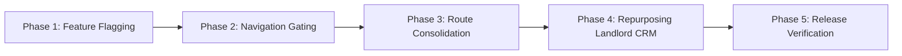

# REHVO V24 — Owner-Centric Zero-Downtime Migration Blueprint

**Version:** REHVO V24.5 Execution Blueprint  
**Launch Target:** Version 1.0 (Owner + Renter Marketplace)  
**Broker Strategy:** Total UI/UX Gating & Isolation (Zero code deletion)  
**Safety Protocol:** Zero Downtime, 100% Reversible, Zero Schema Loss  

---

## 1. Executive Migration Strategy

To launch REHVO V1 as the premier **Zero-Brokerage, Owner-Direct Platform**, all broker interfaces will be isolated and gated. The migration adheres to five atomic, non-destructive phases.

---

## 2. Phase-by-Phase Execution Plan

### Phase 1: Environment Feature Flagging
- Introduce runtime config flag: `EXPO_PUBLIC_ENABLE_BROKER=false`.
- Guard broker component mounts and profile role selectors.
- *Blast Radius*: 0 files modified in production bundle; reversible via `.env`.

### Phase 2: Navigation & Route Gating
- Modify `app/(broker)/_layout.tsx` to redirect any unauthorized access to `app/(owner)/dashboard.tsx` or `app/(renter)/explore.tsx`.
- Remove the "Broker" switch tab from `src/components/v4/navigation/V4TopHeader.tsx` and `app/(auth)/role-select.tsx`.
- *Blast Radius*: Users only see "Owner / Landlord" and "Tenant / Flatmate".

### Phase 3: Route Consolidation & Canonical Redirects
- Implement lightweight redirects from the 11 legacy `app/(renter)/owner-*` routes to `app/(owner)/*`.
- Ensures existing push notifications and external deep links seamlessly resolve to the canonical owner screens.

### Phase 4: Repurpose Broker Tooling for Multi-Unit Landlords
- The sophisticated features built for brokers (multi-unit inventory broadsheets, client lead pipelines, document review) will be exposed to **Portfolio Owners** managing 3+ flats.
- Upgrades individual landlords into professional property managers without broker intermediaries.

### Phase 5: Verification & Store Submission
- Validate test runs on iOS 15.1–18 and Android 14.
- Perform sanity checks on Stripe/Razorpay payouts and Supabase 3D Tour photogrammetry queues.
- Submit to Apple App Store & Google Play Store.

---

## 3. Rollback Protocol

If broker capabilities are ever required in Version 2.0:
1. Toggle `EXPO_PUBLIC_ENABLE_BROKER=true`.
2. Re-enable the role selector button.
3. Zero schema migrations or rollbacks required.
