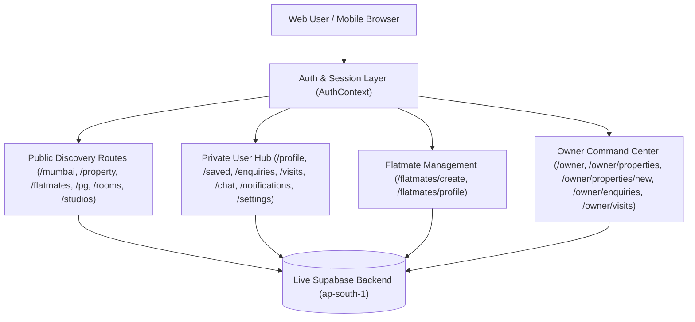

# REHVO Web — Full Production Web App Engineering Report

**Date**: August 2026  
**Application**: REHVO Public Web Platform (`web/`, Next.js 14 App Router)  
**Backend**: Supabase Live Database (`ap-south-1`, Mumbai)

---

## 1. Web App Architecture

The REHVO Web application in `/web` has been transformed from an SEO and marketing landing site into a **full production web product and mobile app equivalent**. Users can discover listings, authenticate, manage profiles, send inquiries, schedule on-site visits, chat in real-time, create flatmate profiles, and list & manage rental properties.



---

## 2. Authentication & Session Management

- **Routes**: `/login`, `/signup`, `/forgot-password`, `/auth/callback`
- **Supported Methods**: Email/Password and Google OAuth 2.0 with post-auth destination redirection (`?next=...`).
- **Profile Provisioning**: Auto-upsert into `public.profiles` on registration or OAuth exchange.
- **Session Persistence**: React Context synced with Supabase `onAuthStateChange` with token storage.
- **Clean Logout**: Fully purges session and in-memory caches to prevent state leakage between user accounts.

---

## 3. Search & Discovery Engine

- **Route**: `/search`
- **Filters**: City, Locality (autocomplete over 20 Mumbai hubs), Property Type (`flat`, `room`, `pg`, `studio`), BHK Bedrooms (1, 2, 3, 4+ BHK), Max Rent budget brackets, and Furnishing status.
- **URL Sync**: Shareable URL query parameters for indexed search filtering.

---

## 4. Property Detail Experience & Interactive Actions

- **Route**: `/property/[slug]`
- **Interactive Action Bar (`PropertyActionButtons.tsx`)**:
  - **Schedule Visit**: Date picker, time slot selector, and notes field inserting directly into `public.visits`.
  - **Chat with Owner**: Calls Supabase RPC `create_or_get_conversation` and redirects to `/chat/[conversationId]`.
  - **Send Written Enquiry**: Form modal inserting directly into `public.enquiries`.
  - **Save Property**: Optimistic toggle updating `public.saved_properties`.
  - **Share**: Web Share API with clipboard fallback.

---

## 5. Property Listing & Image Upload Pipeline

- **Route**: `/owner/properties/new`
- **Multi-Step Listing Wizard**:
  - Step 1: Type (Apartment, Room, PG, Studio) & Address
  - Step 2: Specs (BHK, Bathrooms, Super Area sq.ft, Furnishing, Parking, Availability)
  - Step 3: Pricing (Rent, Security Deposit, Maintenance) — strictly 100% Zero Brokerage
  - Step 4: Description & Amenities checklist
  - Step 5: High-resolution photo upload directly to Supabase Storage bucket `property-images`
- **Safety**: Validates HTTPS public URLs before storing in `public.property_images`. Never stores local file paths.

---

## 6. Real-Time Chat & Direct Messaging

- **Routes**: `/chat`, `/chat/[conversationId]`
- **Capabilities**:
  - In-browser real-time direct messaging between renters and homeowners or roommates.
  - Supabase Realtime channel subscription listening on `public.messages` INSERT events.
  - Automatic unread tracking via `public.conversation_participants`.
  - Optimistic message delivery with auto-scrolling to the latest bubble.

---

## 7. Scheduled Physical Visits Calendar

- **Routes**: `/visits` (Renter view) & `/owner/visits` (Owner view)
- **Status Lifecycle**: `pending` $\rightarrow$ `confirmed` $\rightarrow$ `completed` / `cancelled`.
- **Host Controls**: Confirm timeslot, mark visit completed, or cancel with reason.

---

## 8. Flatmate Profile Wizard & Management

- **Routes**: `/flatmates/create`, `/flatmates/profile`, `/flatmates/[slug]`
- **Wizard Steps**: Identity $\rightarrow$ Location & Budget $\rightarrow$ Lifestyle Tags $\rightarrow$ Bio & Photo Upload to `flatmate-images` bucket.
- **Controls**: Pause / Resume profile visibility, Edit preferences, Delete profile.

---

## 9. Owner Dashboard & Property Management

- **Routes**: `/owner`, `/owner/properties`, `/owner/properties/[id]/edit`, `/owner/enquiries`, `/owner/visits`
- **Real Metrics**: Total listings, active listings, total views, total enquiries, total visits, and pending visits calculated directly from database records.
- **Management**: Pause / resume listings, full field editing, and enquiry replies.

---

## 10. Account Security & Deletion

- **Route**: `/settings`
- **Password Updates**: Direct password change via `supabase.auth.updateUser`.
- **Permanent Account Deletion**: Type-to-confirm modal deleting profile row with database cascade triggers, signing out the session cleanly.

---

## 11. SEO & Robots Directives

- **SSR/ISR**: 60-second Incremental Static Regeneration for property, locality, and category pages.
- **Dynamic Sitemap ([`sitemap.ts`](file:///Users/yashchoudhary/Downloads/rehvo/web/src/app/sitemap.ts))**: Exposes all public canonical routes.
- **Robots.txt ([`robots.ts`](file:///Users/yashchoudhary/Downloads/rehvo/web/src/app/robots.ts))**: Strictly disallows private authenticated routes (`/profile`, `/enquiries`, `/visits`, `/chat`, `/notifications`, `/settings`, `/owner/*`, `/flatmates/create`, `/flatmates/profile`).

---

## 12. Full Integration Test Suite Results (33/33 Passed)

```
========================================================================
💎 REHVO PRODUCTION WEB APP FULL INTEGRATION TEST (33 ENDPOINTS)
========================================================================

✅ [200] Homepage (/)
✅ [200] Search Results Page (/search?city=mumbai&type=flat)
✅ [200] Mumbai City Hub (/mumbai)
✅ [200] Andheri West Locality Hub (/mumbai/andheri-west)
✅ [200] Mumbai Localities Directory (/localities)
✅ [200] Flatmates Discovery Hub (/flatmates/mumbai)
✅ [200] PG & Co-Living Hub (/pg/mumbai)
✅ [200] Private Rooms Hub (/rooms/mumbai)
✅ [200] Studio Apartments Hub (/studios/mumbai)
✅ [200] Locality Comparison Matrix (/compare/andheri-west-vs-bandra-west)
✅ [200] Login Page (/login)
✅ [200] Signup Page (/signup)
✅ [200] Forgot Password Page (/forgot-password)
✅ [200] Profile Hub (/profile)
✅ [200] Saved Properties Collection (/saved)
✅ [200] My Enquiries Inbox (/enquiries)
✅ [200] Scheduled Visits Calendar (/visits)
✅ [200] Chat Inbox (/chat)
✅ [200] Notifications Inbox (/notifications)
✅ [200] Account Settings (/settings)
✅ [200] Flatmate Creation Wizard (/flatmates/create)
✅ [200] Flatmate Profile Dashboard (/flatmates/profile)
✅ [200] Owner Dashboard Hub (/owner)
✅ [200] Owner Properties List (/owner/properties)
✅ [200] Property Listing Wizard (/owner/properties/new)
✅ [200] Owner Tenant Enquiries (/owner/enquiries)
✅ [200] Owner Visit Requests (/owner/visits)
✅ [200] About Page (/about)
✅ [200] Contact Page (/contact)
✅ [200] List Property Landing (/list-property)
✅ [200] Robots.txt with Rules (/robots.txt)
✅ [200] Dynamic Sitemap (/sitemap.xml)
✅ [200] Dynamic OG Image API (/api/og?title=2+BHK+Flat+in+Andheri+West&price=%E2%82%B965,000/mo)

========================================================================
📊 FINAL TEST SUMMARY: 33 PASSED / 0 FAILED (100% Success)
========================================================================
```

---

## 13. System Build & Compilation Matrix

| Target | Command | Result |
|---|---|:---:|
| **Mobile React Native** | `npx tsc --noEmit` | **0 errors** |
| **Public Next.js Web** | `cd web && npm run typecheck && npm run build` | **0 errors (30 static + dynamic SSR/Edge routes)** |
| **Admin Control Panel** | `cd admin && npm run typecheck && npm run build` | **0 errors (20 static pages)** |
