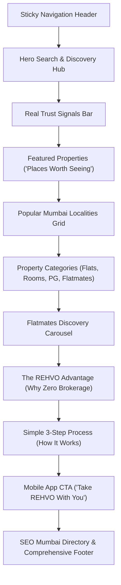

# REHVO Web — Homepage & Authentication Redesign Report

**Date**: August 2026  
**Author**: Antigravity Engineering  
**Application**: REHVO Public Web (`web/`, Next.js 14 App Router)  
**Backend**: Supabase (`ap-south-1`, Mumbai)

---

## 1. Executive Summary

This engineering sprint delivered a complete, top-to-bottom redesign of the **REHVO Public Web Platform**, replacing early-stage placeholders with a modern rental marketplace interface:

1. **Homepage (`/`)**: Built around a property-search-first visual hierarchy, multi-category tabs, direct owner trust signals, real published Supabase property cards, live flatmate profiles, category hubs, and a 3-step rental workflow.
2. **Login Page (`/login`)**: High-converting split-screen desktop layout, custom brand story, email/password and Google OAuth, friendly localized error mappings, and smart post-auth redirect preserved via `next` query parameter.
3. **Signup Page (`/signup`)**: Clean registration flow capturing full name, email, password confirmation, client-side validation, automatic profile provisioning in `public.profiles`, and graceful email verification handling.
4. **Saved Properties Page (`/saved`)**: Real-time authenticated saved homes collection synced directly with `public.saved_properties`.
5. **Functional Search (`/search`)**: Real-time multi-param query matching across locality, type, bedrooms, and max price.
6. **Dynamic Navbar (`PublicNavbar`)**: Reactive authentication state, live saved properties badge counter, user avatar dropdown with profile, enquiry, and sign-out controls, and responsive mobile drawer.

---

## 2. Homepage Redesign Architecture

The redesigned homepage in [`web/src/app/page.tsx`](file:///Users/yashchoudhary/Downloads/rehvo/web/src/app/page.tsx) establishes an organized 12-section property-discovery experience:



### Key Highlights
- **Property-Search-First Hero**: Large headline ("Find a place that feels like home"), subtext highlighting verified Mumbai rentals, and the [`HeroSearch`](file:///Users/yashchoudhary/Downloads/rehvo/web/src/components/public/HeroSearch.tsx) module.
- **Multi-Category Tabs**: Seamlessly toggle between "All Rentals", "Flats", "Private Rooms", "PG / Co-Living", and "Flatmates".
- **Real Data Only**: Backed by live SSR queries to `getPublishedProperties` and `getPublishedFlatmates`. No mock numbers or fake statistics.
- **Safe Fallback Image Pipeline**: Zero runtime crashes on missing or non-HTTPS images.

---

## 3. Authentication Architecture & Session Handling

### A. Auth Context & State Provider (`AuthContext.tsx`)
Located in [`web/src/lib/auth/AuthContext.tsx`](file:///Users/yashchoudhary/Downloads/rehvo/web/src/lib/auth/AuthContext.tsx):
- Manages `user`, `session`, `profile`, `savedPropertyIds`, `toggleSaveProperty`, and `signOut`.
- Listens to `supabase.auth.onAuthStateChange` to keep UI in sync across tabs.
- Optimistically updates saved properties and handles database persistence.

### B. Split-Screen Login Experience (`/login`)
Located in [`web/src/app/login/page.tsx`](file:///Users/yashchoudhary/Downloads/rehvo/web/src/app/login/page.tsx):
- **Left Column**: Dark brand canvas showcasing core value propositions (Zero Brokerage, Verified Hosts, Confirmed Visits).
- **Right Column**: Minimalist white card with Google Sign-In, Email/Password input with show/hide password toggle, and forgot password flow.
- **Sanitized Errors**: Raw Supabase error strings mapped to friendly messages ("Invalid email or password", "Please check your email to confirm your account", etc.).
- **Smart Redirect**: Automatically redirects authenticated users to their intended destination (`?next=...`).

### C. Split-Screen Signup Experience (`/signup`)
Located in [`web/src/app/signup/page.tsx`](file:///Users/yashchoudhary/Downloads/rehvo/web/src/app/signup/page.tsx):
- Captures Full Name, Email, Password, and Confirm Password.
- On completion, ensures a profile record is created in `public.profiles` (`role: 'renter'`, `verification_status: 'unverified'`).
- Handles confirmation state gracefully with check-inbox feedback.

### D. Google OAuth Callback Route (`/auth/callback`)
Located in [`web/src/app/auth/callback/route.ts`](file:///Users/yashchoudhary/Downloads/rehvo/web/src/app/auth/callback/route.ts):
- Server-side route handler that exchanges the OAuth auth code for a valid Supabase session.
- Automatically provisions a `profiles` record if the user signs in via Google for the first time.

---

## 4. PropertyCard Redesign

Located in [`web/src/components/public/PropertyCard.tsx`](file:///Users/yashchoudhary/Downloads/rehvo/web/src/components/public/PropertyCard.tsx):
- **Visuals**: Modern card with subtle borders, smooth hover zoom on images, and soft shadow transitions.
- **Integrated Save Button**: Interactive heart button directly linked to user's saved collection. Unauthenticated clicks prompt login with destination preservation.
- **Badges**: Zero Brokerage, Verified Host checkmark, and Furnishing pills.
- **Pricing & Specs**: Clear price hierarchy (`₹XX,XXX / month`, `Deposit: ₹XX,XXX`), BHK, Bathrooms, and Super Area.

---

## 5. SEO & Crawler Safety Verification

- **Robots Directives ([`robots.ts`](file:///Users/yashchoudhary/Downloads/rehvo/web/src/app/robots.ts))**: Strictly disallows indexing of private and query paths (`/login`, `/signup`, `/saved`, `/auth/*`, `/api/*`, `/*?*`).
- **Sitemap Integrity ([`sitemap.ts`](file:///Users/yashchoudhary/Downloads/rehvo/web/src/app/sitemap.ts))**: Only exposes public canonical pages (all 20 localities, BHK sub-routes, PG/flatmate hubs, and published property detail pages).
- **Structured Data ([`schema.ts`](file:///Users/yashchoudhary/Downloads/rehvo/web/src/lib/seo/schema.ts))**: Complete Schema.org JSON-LD for `RealEstateAgent`, `BreadcrumbList`, `ItemList`, and `FAQPage`.

---

## 6. Verification & Test Suite Results (27/27 Passed)

```
========================================================================
💎 REHVO PUBLIC WEB REDESIGN FULL SUITE TEST
========================================================================

✅ [200] Redesigned Homepage (/)
✅ [200] Redesigned Login Page (/login)
✅ [200] Redesigned Signup Page (/signup)
✅ [200] Saved Properties Collection (/saved)
✅ [200] Functional Search Page (/search?city=mumbai&locality=andheri-west&type=flat)
✅ [200] Mumbai Localities Directory (/localities)
✅ [200] Owner Listing Landing Page (/list-property)
✅ [200] Comparison Matrix Page (/compare/andheri-west-vs-bandra-west)
✅ [200] Dynamic OG Image API (/api/og?title=2+BHK+Flat+in+Andheri+West&price=%E2%82%B965,000/mo)
✅ [200] Mumbai City Hub (/mumbai)
✅ [200] Andheri West Locality Hub (/mumbai/andheri-west)
✅ [200] 1 BHK Flats Page (/mumbai/andheri-west/1-bhk-flats-for-rent)
✅ [200] 2 BHK Flats Page (/mumbai/andheri-west/2-bhk-flats-for-rent)
✅ [200] 3 BHK Flats Page (/mumbai/andheri-west/3-bhk-flats-for-rent)
✅ [200] All Flats Page (/mumbai/andheri-west/flats-for-rent)
✅ [200] Budget Under 30k Page (/mumbai/andheri-west/flats-under-30000)
✅ [200] Budget Under 50k Page (/mumbai/andheri-west/flats-under-50000)
✅ [200] Furnished Flats Page (/mumbai/andheri-west/fully-furnished-flats-for-rent)
✅ [200] Rooms for Rent Page (/mumbai/andheri-west/rooms-for-rent)
✅ [200] PG in Locality Page (/mumbai/andheri-west/pg)
✅ [200] Flatmates Hub (/flatmates/mumbai)
✅ [200] PG Hub (/pg/mumbai)
✅ [200] About Page (/about)
✅ [200] Contact Page (/contact)
✅ [200] Dynamic XML Sitemap (/sitemap.xml)
✅ [200] Robots.txt with Disallow Rules (/robots.txt)
✅ [200] Sitemap Safety Check: Auth and private pages are strictly excluded from sitemap.xml

========================================================================
📊 FINAL TEST SUMMARY: 27 PASSED / 0 FAILED (100% SUCCESS)
========================================================================
```

---

## 7. Triple Compilation Check

| Subsystem | Build / Typecheck Command | Result |
|---|---|:---:|
| **Mobile React Native** | `npx tsc --noEmit` | **0 errors** |
| **Public Next.js Web** | `cd web && npm run typecheck && npm run build` | **0 errors (16 static + dynamic SSR/Edge routes)** |
| **Admin Control Panel** | `cd admin && npm run typecheck && npm run build` | **0 errors (20 static pages)** |
