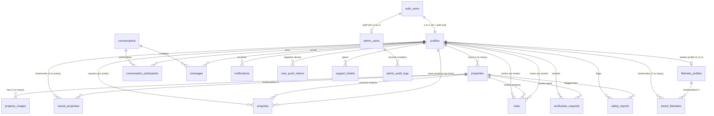

# REHVO Production Supabase Database Schema

> **Document Version**: 1.0.0 (Phase 1 Database Foundation)  
> **Database Engine**: PostgreSQL 15+ (Supabase)  
> **Target Applications**: REHVO Mobile (Expo/React Native) + REHVO Web Admin (Next.js 14)

---

## 1. Relational Entity Overview

---

## 2. Table Specifications & Enums

### 2.1. Core Identity & Localization

#### `public.service_cities`
| Column | Type | Constraints | Description |
| :--- | :--- | :--- | :--- |
| `id` | `UUID` | `PRIMARY KEY, DEFAULT gen_random_uuid()` | Unique city identifier |
| `name` | `TEXT` | `NOT NULL, UNIQUE` | E.g. 'Mumbai', 'Bengaluru' |
| `state` | `TEXT` | `NOT NULL` | E.g. 'Maharashtra', 'Karnataka' |
| `country` | `TEXT` | `NOT NULL, DEFAULT 'India'` | Country |
| `status` | `TEXT` | `CHECK (status IN ('active', 'coming_soon', 'inactive'))` | Service status |
| `sort_order` | `INTEGER` | `NOT NULL, DEFAULT 0` | Display priority |
| `created_at` | `TIMESTAMPTZ` | `DEFAULT NOW()` | Record timestamp |
| `updated_at` | `TIMESTAMPTZ` | `DEFAULT NOW()` | Auto-updated |

#### `public.profiles` (Linked to `auth.users`)
| Column | Type | Constraints | Description |
| :--- | :--- | :--- | :--- |
| `id` | `UUID` | `PRIMARY KEY REFERENCES auth.users(id) ON DELETE CASCADE` | Authenticated user ID |
| `full_name` | `TEXT` | `NOT NULL` | User full display name |
| `email` | `TEXT` | `NULLABLE` | Contact email |
| `phone` | `TEXT` | `NULLABLE` | Verified phone number |
| `profile_photo` | `TEXT` | `NULLABLE` | Avatar storage URL |
| `city` | `TEXT` | `NULLABLE` | Primary living city |
| `state` | `TEXT` | `NULLABLE` | State |
| `locality` | `TEXT` | `NULLABLE` | Micro-locality (e.g. Bandra West) |
| `bio` | `TEXT` | `NULLABLE` | Bio snippet |
| `occupation` | `TEXT` | `NULLABLE` | Profession / Company |
| `user_type` | `TEXT` | `CHECK (user_type IN ('student', 'working_professional', 'family', 'other'))` | Persona classification |
| `role` | `TEXT` | `CHECK (role IN ('renter', 'owner')) DEFAULT 'renter'` | Primary user mode |
| `verification_status`| `TEXT` | `CHECK (status IN ('unverified', 'pending', 'verified', 'rejected'))` | Identity verification |
| `is_blocked` | `BOOLEAN` | `DEFAULT FALSE` | Moderation ban flag |

---

### 2.2. Properties & Inventory (Zero Villa Concept)

#### `public.properties`
| Column | Type | Constraints | Description |
| :--- | :--- | :--- | :--- |
| `id` | `UUID` | `PRIMARY KEY DEFAULT gen_random_uuid()` | Listing ID |
| `owner_id` | `UUID` | `REFERENCES profiles(id) ON DELETE CASCADE` | Lister ID |
| `type` | `TEXT` | `CHECK (type IN ('flat', 'room', 'pg', 'studio'))` | **Strict property types** |
| `title` | `TEXT` | `NOT NULL` | Listing headline |
| `description` | `TEXT` | `NOT NULL` | Detailed property description |
| `price` | `INTEGER` | `NOT NULL` | Monthly rent in INR (₹) |
| `deposit` | `INTEGER` | `DEFAULT 0` | Security deposit in INR |
| `maintenance` | `INTEGER` | `DEFAULT 0` | Monthly maintenance charges |
| `brokerage` | `INTEGER` | `DEFAULT 0` | Direct rental broker fee (0 for no brokerage) |
| `city` | `TEXT` | `NOT NULL` | Metro city |
| `state` | `TEXT` | `NOT NULL` | State |
| `locality` | `TEXT` | `NOT NULL` | Locality name |
| `address` | `TEXT` | `NOT NULL` | Full physical address |
| `latitude` | `FLOAT8` | `NULLABLE` | Geolocation lat |
| `longitude` | `FLOAT8` | `NULLABLE` | Geolocation lng |
| `bedrooms` | `TEXT` | `NOT NULL` | E.g. '1 BHK', '2 BHK', 'Studio' |
| `bathrooms` | `INTEGER` | `DEFAULT 1` | Bathroom count |
| `area` | `INTEGER` | `DEFAULT 0` | Carpet area in sq.ft |
| `furnishing` | `TEXT` | `CHECK (furnishing IN ('fully_furnished', 'semi_furnished', 'unfurnished'))` | Furnishing tier |
| `parking` | `TEXT` | `DEFAULT 'None'` | Parking availability |
| `availability` | `TEXT` | `DEFAULT 'Immediate'` | Move-in ready date |
| `status` | `TEXT` | `CHECK (status IN ('draft', 'published', 'paused', 'removed'))` | Lifecycle status |
| `verification_status`| `TEXT` | `CHECK (status IN ('unverified', 'pending', 'verified', 'rejected'))` | Deed verification badge |
| `amenities` | `TEXT[]` | `DEFAULT '{}'` | Array of amenities |
| `tenant_preferences`| `TEXT[]` | `DEFAULT '{}'` | Bachelor / Family preferences |

#### `public.property_images`
| Column | Type | Constraints | Description |
| :--- | :--- | :--- | :--- |
| `id` | `UUID` | `PRIMARY KEY DEFAULT gen_random_uuid()` | Image record ID |
| `property_id` | `UUID` | `REFERENCES properties(id) ON DELETE CASCADE` | Parent listing |
| `image_url` | `TEXT` | `NOT NULL` | CDN image URL |
| `storage_path` | `TEXT` | `NULLABLE` | Supabase storage key |
| `is_cover` | `BOOLEAN` | `DEFAULT FALSE` | Cover photo flag |
| `sort_order` | `INTEGER` | `DEFAULT 0` | Display gallery order |

---

### 2.3. Flatmates & Roommate Discovery

#### `public.flatmate_profiles`
| Column | Type | Constraints | Description |
| :--- | :--- | :--- | :--- |
| `id` | `UUID` | `PRIMARY KEY DEFAULT gen_random_uuid()` | Flatmate profile ID |
| `user_id` | `UUID` | `UNIQUE REFERENCES profiles(id) ON DELETE CASCADE` | 1-to-1 with user profile |
| `photo` | `TEXT` | `NULLABLE` | Seeker avatar URL |
| `age` | `INTEGER` | `NULLABLE` | Age in years |
| `gender` | `TEXT` | `CHECK (gender IN ('male', 'female', 'any', 'other'))` | Seeker gender |
| `profession` | `TEXT` | `NOT NULL` | Occupation |
| `city` | `TEXT` | `NOT NULL` | Target search city |
| `locality` | `TEXT` | `NOT NULL` | Preferred locality |
| `preferred_locations` | `TEXT[]` | `DEFAULT '{}'` | Multiple preferred localities |
| `bio` | `TEXT` | `NULLABLE` | Roommate intro |
| `budget_min` | `INTEGER` | `DEFAULT 0` | Minimum monthly budget |
| `budget_max` | `INTEGER` | `NOT NULL` | Maximum monthly budget |
| `room_preference` | `TEXT` | `CHECK (room_preference IN ('private_room', 'shared_room', 'any'))` | Room type desired |
| `move_in_date` | `TEXT` | `NOT NULL` | Target move-in timing |
| `lifestyle_preferences` | `TEXT[]` | `DEFAULT '{}'` | Tags (Non-Smoker, Night Owl, etc.) |
| `status` | `TEXT` | `CHECK (status IN ('draft', 'published', 'paused'))` | Profile discovery state |

---

### 2.4. Interactions (Saved Items, Enquiries, Visits)

* `public.saved_properties`: `(user_id, property_id)` with `UNIQUE` constraint.
* `public.saved_flatmates`: `(user_id, flatmate_profile_id)` with `UNIQUE` constraint.
* `public.enquiries`: `(user_id, property_id, owner_id, message, status)` where status $\in$ `['pending', 'replied', 'scheduled', 'closed']`.
* `public.visits`: `(property_id, user_id, owner_id, scheduled_date, scheduled_time, status, notes)` where status $\in$ `['pending', 'confirmed', 'completed', 'cancelled']`.

---

### 2.5. Realtime Chat & Notifications

* `public.conversations`: Tracks direct threads between Renters, Hosts, and Flatmate seekers with `last_message_text` and `last_message_at`.
* `public.conversation_participants`: `(conversation_id, user_id, unread_count, last_read_at)`.
* `public.messages`: `(conversation_id, sender_id, message, message_type, read_at)`.
* `public.notifications`: `(user_id, type, title, body, data, read_at)`.
* `public.user_push_tokens`: `(user_id, push_token, device_os)` with `UNIQUE(user_id, push_token)`.

---

### 2.6. Trust, Safety & Admin Governance

* `public.verification_requests`: `(user_id, property_id, target_type, document_url, status, reviewed_by, rejection_reason)` where status $\in$ `['pending', 'verified', 'rejected']`.
* `public.safety_reports`: `(reporter_id, property_id, target_user_id, reason, description, severity, status)` where status $\in$ `['pending', 'under_review', 'resolved', 'dismissed']`.
* `public.support_tickets`: `(user_id, subject, description, priority, status, assigned_admin_id)`.
* `public.admin_users`: `(user_id, email, full_name, role, status)` where role $\in$ `['super_admin', 'operations', 'verification', 'moderation', 'support', 'finance', 'content_manager']`.
* `public.admin_audit_logs`: Immutable append-only audit trail `(admin_user_id, admin_email, admin_role, action, target_type, target_id, metadata, ip_address)`.
* `public.system_settings`: Key-value JSONB platform parameters `(key, value, description, updated_by)`.

---

## 3. Storage Buckets & Policies

| Bucket ID | Public Access | File Size Limit | Allowed MIME Types | Purpose |
| :--- | :--- | :--- | :--- | :--- |
| `property-images` | `TRUE` | 10 MB | `image/png, image/jpeg, image/webp` | Property gallery imagery |
| `profile-images` | `TRUE` | 5 MB | `image/png, image/jpeg, image/webp` | User profile avatars |
| `flatmate-images` | `TRUE` | 5 MB | `image/png, image/jpeg, image/webp` | Roommate seeker photos |
| `verification-documents` | **`FALSE` (Private)** | 25 MB | `application/pdf, image/png, image/jpeg, image/webp` | Sensitive ownership deeds & KYC |

---

## 4. Capability Logic Matrix

The schema enforces REHVO's core multi-capability account model:

1. **Renter Capability**: Every authenticated profile can browse, save, enquire, and book visits.
2. **Owner / Lister Capability**: Activated when user creates their first listing in `public.properties`. Lister workspace queries `public.properties WHERE owner_id = auth.uid()`.
3. **Flatmate Capability**: Activated when user creates a row in `public.flatmate_profiles WHERE user_id = auth.uid()`.
4. **Admin Capability**: Enforced strictly through `public.admin_users WHERE (user_id = auth.uid() OR email = auth.jwt()->>'email') AND status = 'active'` checked by `public.is_admin()`.
